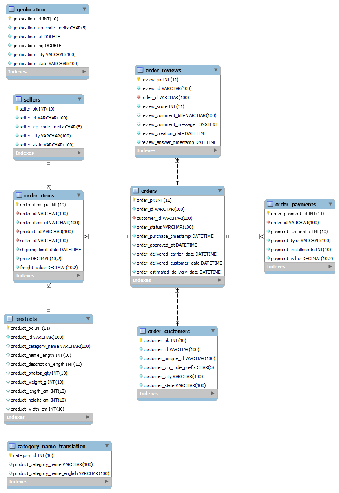

# Olist E-Commerce EDA

## Overview
This project analyzes a Brazilian e-commerce dataset provided by Olist, which includes transactional data from multiple dimensions, such as order status, pricing, customer location, and product reviews. The goal is to prepare and structure the data for analysis, identify trends, and make recommendations to improve data quality and architecture.

## Data Source
Brazilian E-Commerce Public Dataset by Olist downloaded from [kaggle](https://www.kaggle.com/datasets/olistbr/brazilian-ecommerce/data). The following information are also provided by kaggle:
- This dataset contains information on over 100,000 orders from 2016 to 2018, anonymized and shared by Olist, a major online marketplace in Brazil. The data spans multiple order aspects, including customer feedback and geolocation information.
- Olist connects small Brazilian businesses to various marketplaces, enabling seamless logistics and delivery to customers. After purchase, customers provide feedback through a satisfaction survey.
- Note: All company names and partner names in customer reviews have been replaced with fictional names from Game of Thrones.

## Tech Stack
- **Database**: MySQL (for data loading and indexing)
- **Data Processing**: Python, pandas

## Data Preparation

### 1. Database Creation
Before loading the data, a database named ```olist``` is created, and tables are set up with appropriate schemas to store each dataset component.

**Query snippet:**

```sql
CREATE DATABASE olist;

CREATE TABLE olist.order_customers (
    customer_pk INT UNSIGNED AUTO_INCREMENT PRIMARY KEY COMMENT "surrogate primary key for customers",
    customer_id VARCHAR(100) UNIQUE NOT NULL COMMENT "unique key for each order",
    customer_unique_id VARCHAR(100) NOT NULL COMMENT "unique key for a customer",
    customer_zip_code_prefix CHAR(5) NOT NULL COMMENT "first five digits of customer zip code",
    customer_city VARCHAR(100) NOT NULL COMMENT "customer city name",
    customer_state VARCHAR(100) NOT NULL COMMENT "two-letter state code"
);	
```

### 2. Indexing

Each table has unique indices to avoid duplicate entries and improve data retrieval.

**Query snippet:**
```sql

CREATE UNIQUE INDEX unique_orders ON olist.orders (customer_id, order_id);
CREATE UNIQUE INDEX unique_customer_orders ON olist.order_customers (customer_id, customer_unique_id);
```

Foreign keys are also set up between tables to establish relationships.

**Query snippet:**
```sql
ALTER TABLE `olist`.`order_items` ADD CONSTRAINT `fk_orders_orditems_order`
FOREIGN KEY (`order_id`) REFERENCES `olist`.`orders` (`order_id`);
```

**Data schema:**



```category_name_translation``` table was not foreign-keyed to ```products``` due to some missing ```product_category_name``` values.

### 3. Data Loading

Each CSV file is loaded into a separate table within the olist database.

**Query snippet:**

```sql
LOAD DATA INFILE 'my_directory/olist_order_customers_dataset.csv'
INTO TABLE olist.order_customers
FIELDS TERMINATED BY ','
ENCLOSED BY '"'
LINES TERMINATED BY '\n' 
IGNORE 1 ROWS
(customer_id,customer_unique_id,customer_zip_code_prefix, customer_city, customer_state);
```

### Data Cleaning
[```data_cleanup.py```](data_cleanup.py) performs the following data preparation steps:

1. **Column inspection and renaming:** All columns are inspected for data types, with misspelled columns renamed to avoid future errors (e.g., product_name_lenght to product_name_length).
2. **Handling duplicates:** Duplicate rows across dataframes are identified and removed.
3. **Handling invalid characters:** Identified non-alphanumeric characters in text columns, allowing for review and cleaning as needed.
   
    - Any cells with empty strings or spaces are replaced with NaN values to standardize missing data handling.
   
    - To handle inconsistencies in city names (e.g., special characters in geolocation_city), city names are converted to their closest ASCII equivalents using unidecode, and duplicates are dropped based on geolocation_zip_code_prefix, geolocation_state, and geolocation_city.

## Data Analysis
_To be completed in future stages._

## Recommendations
- **```geolocation_city``` standardization**: A controlled vocabulary for city could reduce duplicates and discrepancies due to special characters.
- **Database architecture**: If Olist’s website directly inputs this data to their database, implementing these data cleaning and normalization practices within the database could help maintain consistency and reliability in production.
